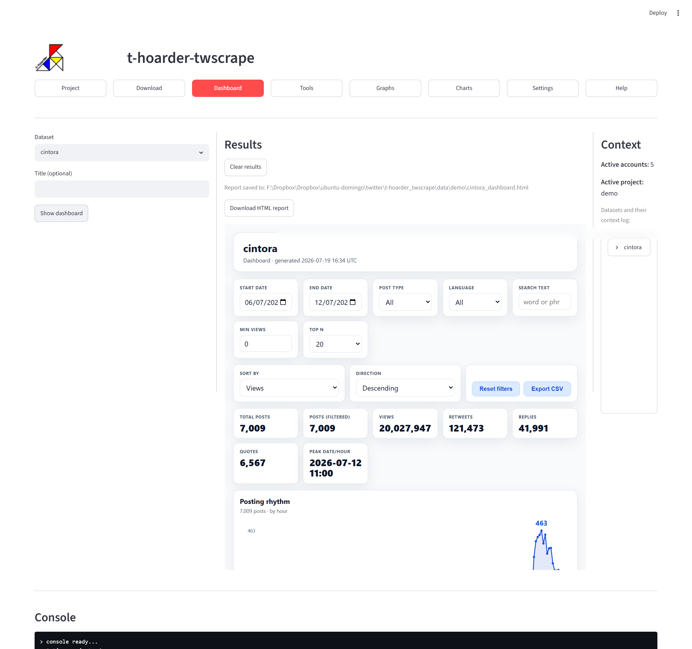
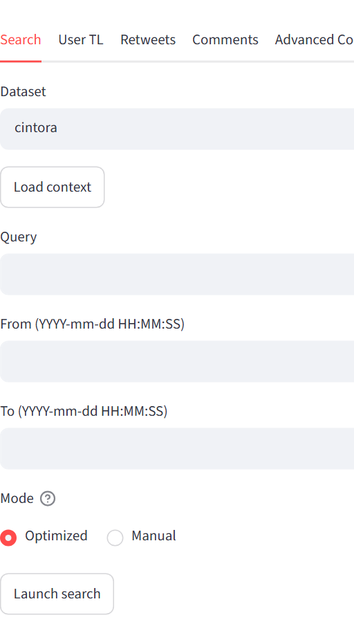
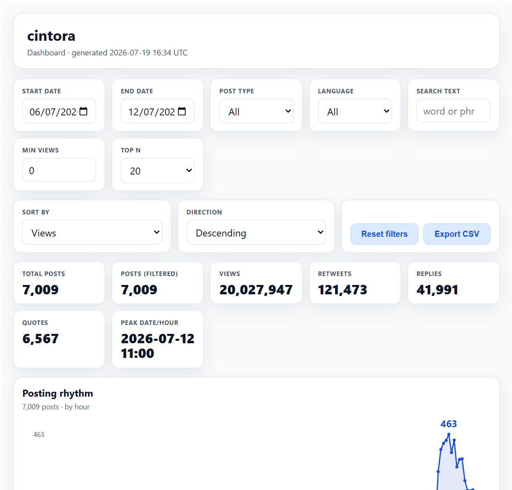

<p align="center">
  
</p>

<h1 align="center">User guide</h1>

<p align="center">
  <a href="guia-de-uso.md">Español</a> · <b>English</b>
</p>

---

**Contents** ·
[Structure](#structure-of-t-hoarder-twscrape) ·
[Project](#project) ·
[Download](#download) ·
[Dashboard](#dashboard) ·
[Tools](#tools) ·
[Graphs](#graphs) ·
[Charts](#charts) ·
[Settings](#settings)

## Structure of t-hoarder-twscrape

The app screen is organized into five fixed zones, the same in every
section. Once you understand this structure, every function works the same
way: pick the function at the top, fill in the form on the left, launch the
operation, and the result appears in the center.

```
┌──────────────────────────────────────────────────────────────────────────────┐
│  logo · t-hoarder-twscrape                                                   │
│  [Project] [Download] [Dashboard] [Tools] [Graphs] [Charts] [Settings] [Help]│
├────────────────┬────────────────────────────────────────────┬────────────────┤
│  Sub-functions │                                            │  Execution     │
│  Input form    │                  Results                   │  context       │
│                │                                            │                │
│  [Run]         │                                            │                │
├────────────────┴────────────────────────────────────────────┴────────────────┤
│  Execution console                                                           │
└──────────────────────────────────────────────────────────────────────────────┘
```



### Top · Function menu

A row of buttons gives access to the app's functions:

- **Project** — create and select the working project.
- **Download** — data downloads with twscrape.
- **Dashboard** — interactive dashboard for a dataset.
- **Tools** — dataset utilities (merge, clean, compare…).
- **Graphs** — relationship graphs and community detection.
- **Charts** — analysis charts for tweets and profiles.
- **Settings** — twscrape account management.
- **Help** — this user guide, shown inside the app itself.

On startup the selected section is **Project**: the first step is always to
choose (or create) the project you are going to work on.

### Left · Sub-functions and form

Each function is divided into **sub-functions** (for example, Download
offers Search, User TL, Retweets, Comments and Advanced Comments). When you
pick a sub-function, this zone shows its **input form** and, at the end,
the **button that launches the operation**.

### Center · Results

The result of the executed operation appears here: a table with the
generated data, the Charts figures (in carousel mode, one at a time), the
dashboard or the embedded HTML reports, or the interactive graph viewer.
When the result is a file, a preview is shown and, where applicable, a
download button. The **"Clear results"** button empties the panel.

### Right · Execution context

Summarizes the current working situation:

- The twscrape **active accounts**.
- The **active project**.
- The project's **downloads with saved context**: one entry per dataset,
  expandable to see the details of its downloads (query or users, dates,
  product, frequency).

### Bottom · Execution console

Shows the progress of the running operation, one message per line, as it
executes. Errors are highlighted in red. In long operations (downloads),
this is how you follow where the process is.

## Project

To organize the data, the app proposes the concept of a **project**: a
project groups a set of related datasets (for example, all the downloads
about the same topic or event). On disk, each project is simply a folder
inside `data/` with its name, and all its dataset files live there.

The number of datasets per project is not limited, although too many can
become unwieldy. How to organize them is left to each user's judgement.

**First things first**: the app starts in this section because, before
downloading or analyzing anything, an active project is required — create a
new one or select an existing one.

- **Select project** — selects the working project from a dropdown of the
  active projects, ordered by activity (most recently active first). When
  you select it, the Context window (right side) shows, besides the number
  of active accounts, the active project and its datasets with their
  context (each one expandable to see its download details). From then on
  you work **only with that project's data**: the Dataset dropdowns of the
  other sections list only its datasets.

- **New project** — creates a new project, which amounts to creating the
  `data/{name}` folder. The newly created project is also **activated as
  the working project**, so you can go straight to Download to fill it with
  data. The name cannot be empty or contain characters that are invalid for
  a folder (`\ / : * ? " < > |`); if a project with that name already
  exists (active or deactivated), the console reports the error.

- **Active projects** — shows the list of existing (active) projects in
  the results panel.

- **Deactivate project** — lets you **archive** a project you are not
  using often, so the list of active projects does not grow too large. **It
  never deletes anything**: it just moves the project folder from
  `data/{project}` to `data/desactivated/{project}`, with all its data
  intact. If the archived project was the active one, it stops being active
  (you will need to select another or reactivate it).

- **Reactivate project** — the way back: moves a deactivated project to
  the active group (its folder goes from `data/desactivated/` back to
  `data/`) and leaves it **selected as the working project**.

## Download

This section downloads Twitter/X data through twscrape. Before going into
the options, it helps to understand four concepts that explain why the
downloads work the way they do.

### Key concepts

- **Rate limit** — X limits the requests it accepts from each account, per
  operation and in **15-minute** cycles. For search, the quota is around 50
  requests per cycle and each request brings a page of ~20 tweets: about
  **900–1,000 tweets per account every 15 minutes**. It is not a fixed or
  documented figure: X announces it in each response and can change it;
  twscrape simply obeys it. That is why the app requests at most ~900
  tweets per query and pauses a few seconds between queries: burning the
  quota in a burst only makes X return empty responses.

- **Account pool** — when an account exhausts its quota for an operation,
  twscrape sets it aside until X unlocks it and **continues with another
  active account** from the pool, transparently. The more accounts
  registered (see *Settings*), the more download throughput; with a pool of
  5 or more you can work comfortably.

- **Why downloads are bounded between dates** — X's search engine does not
  return everything that exists for a query: each search has a limited
  depth. To avoid losing tweets, the app slices the requested period into
  **time windows** (the *frequency*: month, week, day, hours…) and issues
  one query per window. If a window still returns so many tweets that it
  hits the search ceiling (500 or more), that stretch may be incomplete:
  this is what we call **overflow**, and the app detects and handles it
  (how, depends on the download mode; see *Search*).

- **Product: Top and Latest** — X offers two search products, the same as
  the tabs of its web search:
  - **Top**: a curated selection of the most relevant tweets.
  - **Latest**: the chronological flow.

  Empirically we have found that **Latest works better at frequencies of
  one day or longer, and Top at frequencies under one day**. That is why
  the app provides an **optimized method** that uses the best option at
  each moment:

  1. Depending on the length of the requested period, it picks the initial
     frequency (up to 1 month → 1-day windows; up to 6 months → 1-week;
     longer → 1-month), always with *Latest*.
  2. If a window overflows (500 tweets or more: it may be incomplete), it
     **re-downloads it subdivided** at the next frequency of the ladder
     month → week → day → 6 h → 3 h → 1 h → 30 min, recursively until no
     sub-window overflows or 30 minutes is reached.
  3. Below one day, it switches from *Latest* to *Top*, which is where Top
     performs best.

  The method respects the pause between all queries, including the
  subdivided ones, to avoid burning the quota in a burst.

### Two kinds of downloads

- The **main ones** — *Search* and *User TL*. These create a dataset: they
  download tweets bounded between two dates, from a query or from a list
  of users.
- The **complementary ones** — *Retweets*, *Comments* and *Advanced
  Comments*. They start from an already-downloaded dataset and enrich it:
  who retweeted its tweets and what replies they received. They are the raw
  material for the graphs of the *Graphs* section.

All downloads are **resumable**: if they are interrupted (or stopped on
purpose), just relaunch them with the same dataset and they continue where
they left off, thanks to the context saved with each dataset.

### The options, one by one



- **Search** — historical tweet search from a query. Fields:
  - *Dataset*: an existing one (to continue or extend a download) or
    "➕ new dataset…" to create one.
  - *Load context*: if the dataset already has downloads, it fills the form
    with the parameters saved from the last one.
  - *Query*: the query, with the same syntax as X's search (it supports
    advanced operators: `"exact phrase"`, `OR`, `from:user`, `lang:en`,
    `filter:replies`…).
  - *From / To*: the period, in `YYYY-mm-dd HH:MM:SS` format.
  - *Mode*: the key decision of the form.
    - **Optimized** (recommended): asks for nothing else. It applies the
      **optimized method** described in the key concepts: the app picks the
      product and the frequency by itself and subdivides overflowing
      windows until each stretch is fully captured.
    - **Manual**: also asks for *Product* (Top | Latest) and *Frequency*,
      and uses them as given. Overflow here is only reported in the console
      and logged to `{dataset}_overflow.csv`; with that file, the user
      decides to re-download the incomplete stretches at a finer frequency
      (into a new dataset) and merge them afterwards with *Tools → Merge
      datasets*.
  - Files it generates: `{dataset}.csv` (the tweets of the period, without
    duplicates), `{dataset}_raw.csv` (everything collected, untrimmed), the
    context log and, if there was any, the overflow log.

- **User TL** — downloads the tweets of one or several users
  (comma-separated list, without `@`). The rest of the form is like
  Search's: dates, *Load context* and the same two modes; in Optimized, the
  criterion is applied **user by user**. Instead of requesting the user's
  timeline (which X limits to their ~3,200 most recent tweets), it runs a
  `from:user` search, which allows downloading **all their original
  tweets** without that limit. The trade-off is that **the retweets made by
  the user are not downloaded** (the search does not return them).

- **Retweets** — for each tweet of the dataset with at least *Min RTs*
  retweets, it downloads **the profiles of the users who retweeted it**
  (not the retweets as tweets): username, followers, account creation date,
  declared location… It generates `{dataset}_RTs.csv`, one row per
  retweeter and tweet. The *Min RTs* threshold helps focus on the tweets
  with real spread and not spend quota on those barely retweeted. It is the
  basis of the RT graphs in *Graphs*.

- **Comments** — for each tweet of the dataset with at least *Min Replies*
  replies, it downloads those replies (which are full tweets) and generates
  `{dataset}_replies.csv`. It uses each tweet's conversation thread, which
  is fast but does not always reach every reply of large conversations.

- **Advanced Comments** — same goal as Comments, but using the search
  engine: for each tweet it runs searches over its conversation
  (`conversation_id`) sliced into windows from the tweet's date until
  *Last* days later, with the chosen *Frequency*. It goes much deeper in
  conversations with hundreds of replies, at the cost of more quota. It has
  its own overflow detection
  (`{dataset}_replies_advanced_overflow.csv`) and generates
  `{dataset}_replies_advanced.csv`.

## Dashboard

The dashboard documents itself: given a dataset, it generates an
interactive view with the **main KPIs** (tweets, views, retweets, replies,
quotes, and the day and hour of peak activity), an **activity chart** (the
posting rhythm over the period) and the **most relevant tweets**, sortable
by different criteria (views, retweets, replies, likes, author's followers,
date…).



The whole view can be **filtered** — by date range, tweet type (original,
reply, quote), language or **words in the text** — and the KPIs, the chart
and the table are recalculated instantly. The filtered selection can be
exported to CSV.

Usage: choose the *Dataset* (and an optional title), press **Show
dashboard** and the result appears in the center panel. The dashboard is a
**self-contained HTML** (`{dataset}_dashboard.html` in the project folder)
that works offline and without installing anything: with the download
button you can save it and **share it as a single file** that anyone can
open in their browser. If the dataset has not changed since last time, the
already-generated one is reused instead of recalculating it.

## Tools

Utilities to manage the datasets of the active project. Two of them (Merge
and Clean) overwrite datasets, so it is worth knowing the house rule right
away: **t-hoarder-twscrape never deletes any data**. When the result of an
operation lands on a dataset that already existed, the previous version is
saved first with a suffix carrying the operation date
(`{dataset}_prev_<date>.csv`), and you can always go back to it.

- **Merge datasets** — merges datasets **of the same kind** (all search or
  all timeline) from the active project, removing duplicate tweets. Its
  typical use: completing a manual download that had overflow — the
  incomplete stretches are re-downloaded at a finer frequency into a
  separate dataset and merged here with the original. If the destination
  dataset is one of the sources, its previous version is kept with the date
  suffix.

- **Clean dataset** — be aware that X's search returns a small percentage
  of tweets that do not match the requested query. This utility filters the
  dataset by three combinable criteria: **languages** (the ones to keep),
  **positive words** (the tweet stays if it contains any) and **false
  positives** (tweets containing them are discarded); comparisons ignore
  case and accents. As a result it provides the filtered dataset and also
  shows **the removed tweets**, sorted by retweets, so you can check at a
  glance that the filter was correct and did not sweep away valid tweets.
  As in Merge, if the destination already existed, the previous version is
  kept with the date suffix.

- **Restore dataset** — regret has a remedy: if a filter (or a merge) does
  not convince you, this option returns the dataset to a previous version,
  chosen by the date of its suffix in a dropdown (showing each version's
  date and size). Restoring also saves the current version first, so it is
  reversible in both directions.

- **Compare datasets** — shows the differences between two or more
  datasets. It is useful, for example, to compare downloads of the same
  query made with different frequencies or products. It generates a
  self-contained HTML report with three blocks: the summary of each dataset
  (period, number of tweets and the sum of their impacts: views, RTs,
  replies, quotes), the **shared tweets** among all of them (in number and
  percentage), and a **timeline chart** with the tweets collected by each
  download, with an adjustable time unit (hour, day, week, month).

- **Location** — analyzes the location declared in the profiles of the
  dataset's authors and structures it into **country, region and city**
  (for Spain, the region is the autonomous community). Geocoding is offline
  (it consumes no quota) and generates `{dataset}_loc.csv`. It is useful,
  above all, to add location as a node attribute in the *Graphs* section.

## Graphs

This section builds and visualizes **graphs of relationships between
users**: who retweets or replies to whom. They are the classic tool to see
the structure of a conversation — the poles that form, who the central
users of each one are and how they connect (or not) with each other.

### Key concepts

- **The relation** — the graph is built from one of the complementary
  downloads of *Download*: **RT** (who retweeted whom, from the Retweets
  file), **replies** or **replies_advanced** (who replied to whom, from
  Comments or Advanced Comments). Each user is a node; each relation, a
  directed edge whose weight is the number of times it repeats.

- **The communities** — groups of users more connected among themselves
  than with the rest, detected with the **Louvain** algorithm. In an RT
  graph they usually correspond to the opinion poles of the conversation.
  The algorithm is not deterministic (each run can yield slightly different
  communities), which is why the result is stored on disk and the following
  steps always reuse the same one instead of recalculating it.

- **A user's relevance** is measured by their **weighted indegree**: the
  number of RTs (or replies) they received. It is what determines the size
  of each node in the viewer.

The typical flow is: **Detect communities** → **Generate graph** →
**Visualize graph** (and, if you want to analyze tweets by community in
*Charts*, also **Classify tweets**).

### The options, one by one

- **Detect communities** — the **relations** (RTs, replies or
  replies_advanced) are needed, so it is essential to have downloaded them
  previously in *Download*. Given a dataset and a relation, it builds the
  graph, keeps its **giant component** (the largest connected part) and
  detects the communities with the **Louvain** algorithm. As a result it
  provides the table of communities with their size as a percentage of
  nodes (`{dataset}_{relation}_communities.csv`) and each user's community
  assignment, with their in and out degrees
  (`{dataset}_users_{relation}_communities.csv`).

- **Generate graph** — given a dataset and a relation, it generates the
  graph in **GDF or GEXF** format, ready for the app's viewer or to open in
  [Gephi](https://gephi.org). Each node carries its user's profile as
  attributes: account age (creation year), verification, and their metrics
  — followers, following, tweets, favorites and lists — in logarithmic
  scale. Two checkboxes also allow adding the **community** (from Detect
  communities) and the **location** (from Tools → Location), very useful to
  color or filter the graph.

- **Classify tweets** — requires having run *Detect communities* first.
  Given a dataset and a relation, it classifies each tweet with its
  author's community and generates `{dataset}_{relation}_classified.csv`.
  It is the file *Charts* uses for the per-community charts (what each pole
  of the conversation says).

- **Visualize graph** — renders a graph of the project (.gdf/.gexf) with
  the **ForceAtlas2** layout (the same as Gephi), computed live in the
  browser: you see the graph unfold, and you can pause and resume it. In
  the form you specify the **maximum labels per community** and the
  **number of iterations**; once in the viewer you can adjust the layout
  parameters (*Scaling*, *Gravity*, *LinLog*, *Dissuade hubs*). Each
  community has a color (those under 2% are grouped in gray as "Others")
  and each node's size reflects its weighted indegree. What you can do:
  - **Explore**: zoom and pan; hovering over a node highlights its
    neighborhood and a tooltip shows its attributes; clicking opens a panel
    with its metrics and the link to its profile on x.com; there is a node
    search with zoom to the found user.
  - **Filter**: the community legend is clickable to hide or show each
    one, and a degree filter (minimum indegree) lets you keep the relevant
    users.
  - **Measure**: the status bar shows the graph's density, reciprocity and
    modularity.
  - **Export**: to **PNG** in high resolution (respecting the active
    filters, with the legend included) or to **GEXF** with positions and
    colors, to keep working in Gephi.

## Charts

In-depth analysis charts, ready to use in a report or a publication. Two
sets are generated, one per dataset type:

- **Tweets** — for *Search* datasets: tweets related to a search for
  keywords or hashtags, where very diverse profiles interact. The charts
  look at the conversation as a whole: activity and impact (reach, RTs),
  the **influencers** who drive it, most frequent words, mentions of
  media outlets…

  You specify the *Dataset*, the title prefix that all the charts will
  carry, the time zone and the minimum reach and RT values above which
  influencers are labeled in the charts. Optionally you can:
  - **Include the communities** (they must have been computed before in
    *Graphs*, with *Detect communities* and *Classify tweets*): adds the
    per-community charts — how much each pole of the conversation posts
    and which words it uses.
  - **Add a topics file**, to track the presence of those topics in the
    tweets.
  - **Add an events file**, to annotate the charts at specific points in
    time (the "what happened that day" that explains a spike).
  - **Zoom**: restrict all the charts to the stretch between two given
    dates, instead of using the whole period.

- **Users** — for *User TL* datasets: the tweets of one or more profiles.
  The charts are generated **for a single profile at a time**, so besides
  the *Dataset* you must indicate the user, along with the title prefix and
  the time zone. They portray the account's behavior: its **daily routine**
  (at what hours it posts, and from which application), its weekly and
  monthly rhythm, the impact and engagement of its tweets, the evolution by
  language and by source, and its most frequent words. It also accepts the
  topics and events files.

In both cases there are two buttons: **generate the charts**, which are
shown in the results panel in carousel mode and saved as PNG in
`data/{project}/{dataset}_graficas/`, or **generate a self-contained HTML
report** with all of them (embedded images, header and index): a single
file you can share and open in any browser.

## Settings

twscrape account management. It is the first thing to configure after
installing the app — and, once configured, the least touched (which is why
the button goes at the end of the menu).

twscrape needs at least one **authenticated account with cookies** to be
able to download data. If more accounts are registered, it will rotate them
to spread the request quota (the *account pool* explained in *Download*).
Recommendations:

- A **pool of 5 accounts or more**.
- **Do not use your personal account**, in case Twitter/X blocks it at
  some point.
- Accounts with **some age and activity** are preferable.

### How to get an account's cookies?

1. Open **Chrome** and log in to [https://x.com](https://x.com) with the
   account you are going to register.
2. Press **F12** (Developer tools) → **Application** tab → **Cookies** →
   `https://x.com`.
3. Copy the values of **`auth_token`** and **`ct0`**.

### The options

- **New Account** — registers an account. Fill in:
  - *Username* — the account's username
  - *Password* — the account's password
  - *Email* — the email associated with the account
  - *Email Password* — that email's password
  - *Auth Token* — the `auth_token` cookie obtained above
  - *ct0* — the `ct0` cookie obtained above

- **Active Accounts** — shows the list of registered accounts and their
  status, to check at a glance how many you are downloading with.

- **Delete Account** — removes an account from the pool (for example, if X
  has blocked it and it no longer contributes quota).
